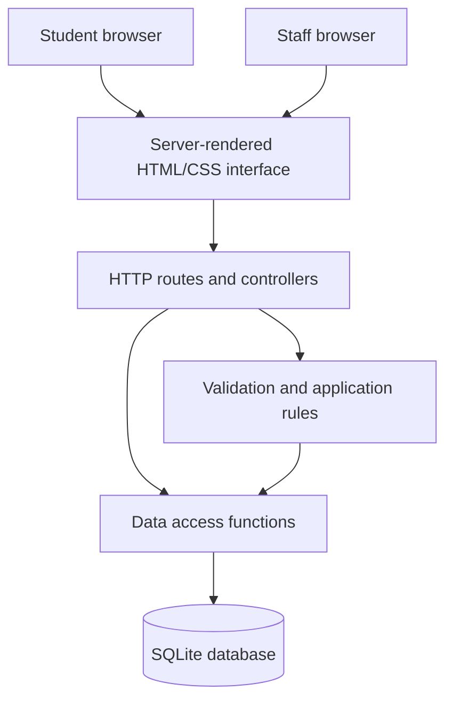
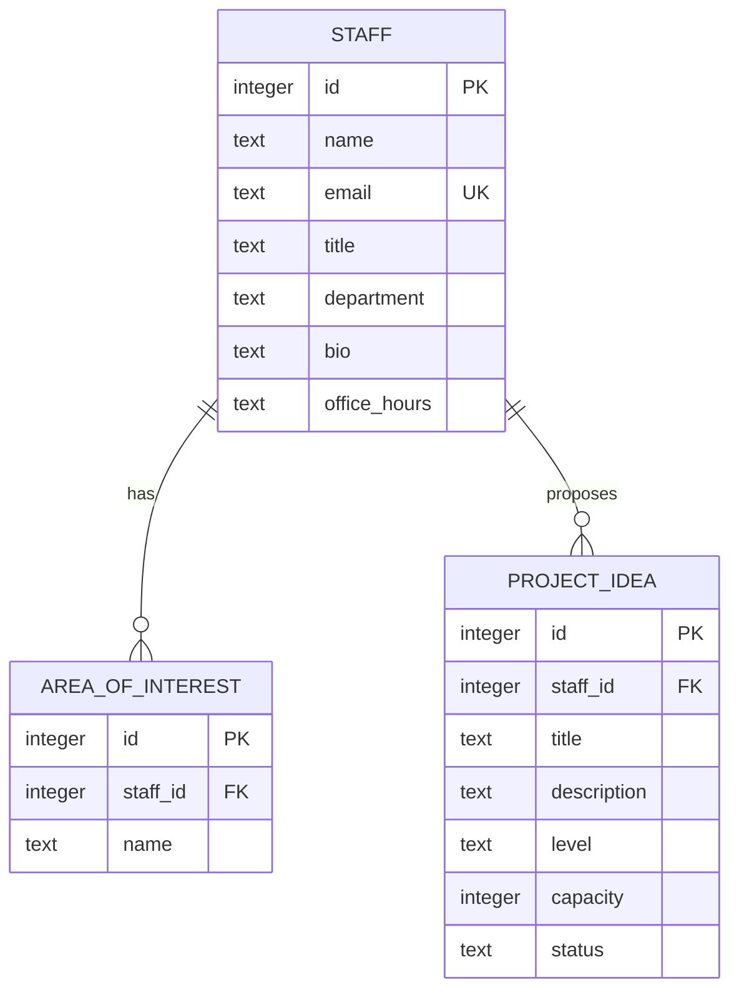
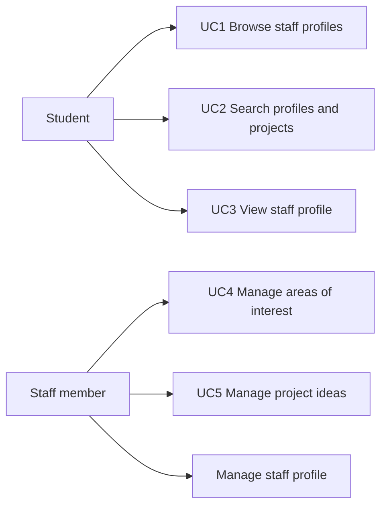

# Supervisor Match Design

This document supplies implementation-aligned design evidence for Chapter 2. The
final report should explain and evaluate these diagrams in the student's own words.

## Architecture

The prototype uses a layered server-rendered web architecture. This keeps the
browser, request handling, validation and persistence responsibilities distinct
while remaining proportionate to the coursework prototype.

| Layer | Responsibility | Main evidence |
| --- | --- | --- |
| Interface | Browse, search, profile and staff workspace screens | HTML generation in `app.py`; `static/style.css` |
| Routes/controllers | Interpret GET/POST requests and choose responses | `SupervisorHandler` |
| Application rules | Required fields, email format and capacity boundaries | `validate_staff`, `validate_project` |
| Data access | CRUD and queries for profiles, areas and projects | Named data functions in `app.py` |
| Persistence | Relational storage and referential deletion | SQLite schema and automated tests |

## Data Model

The one-to-many relationships reflect the brief: one staff member can publish
several interests and several project ideas. Foreign keys use cascade deletion so
removing a staff record cannot leave orphaned interests or projects.

## Use Case Overview

## UC1: Browse Staff Profiles

- Primary actor: Student.
- Preconditions: At least one published staff profile exists.
- Trigger: The student opens the browse page.
- Main flow: The system retrieves staff summaries; displays name, department,
  interests and project count; the student scans the list.
- Alternative flow: If no profiles exist, the system shows an empty-state message.
- Postcondition: No data changes; the student can select a profile.
- Requirements: UR4, FR4, NFR1, NFR4, NFR6.

## UC2: Search Profiles And Projects

- Primary actor: Student.
- Preconditions: Staff profiles exist.
- Trigger: The student submits a search term.
- Main flow: The system normalises the query; matches name, department, interest
  and project title; displays matching staff summaries.
- Alternative flow: A blank query returns all profiles; no match produces an
  empty-state message without an error.
- Postcondition: No data changes; filtered results remain visible.
- Requirements: UR5, FR4, NFR4.

## UC3: View Staff Profile

- Primary actor: Student.
- Preconditions: The selected profile exists.
- Trigger: The student selects `View profile`.
- Main flow: The system retrieves staff details, interests and project ideas; shows
  availability, level and capacity for each project.
- Alternative flow: A missing or deleted profile returns a not-found response.
- Postcondition: No data changes; the student has information to compare options.
- Requirements: UR4, FR4, NFR1, NFR6.

## UC4: Manage Areas Of Interest

- Primary actor: Staff member.
- Preconditions: The staff profile exists and its edit screen is open.
- Trigger: The staff member adds or removes an interest.
- Main flow: The system validates non-empty text; stores the interest; redirects to
  the edit screen; displays confirmation; the public profile reflects the change.
- Alternative flow: Blank input is rejected; a missing area produces no unrelated
  data change.
- Postcondition: The area list is updated consistently.
- Requirements: UR2, FR2, NFR2, NFR3.

## UC5: Manage Project Ideas

- Primary actor: Staff member.
- Preconditions: The staff profile exists.
- Trigger: The staff member creates, edits or deletes a project idea.
- Main flow: The system validates required fields and capacity; stores the change;
  redirects with confirmation; displays the updated project publicly.
- Alternative flows: Capacity outside 1-8 or a missing required field is rejected;
  deleting a project removes only that project.
- Postcondition: Project data is created, updated or deleted and persists in SQLite.
- Requirements: UR3, FR3, NFR2, NFR3.

## Route Map

| Method | Route | Purpose |
| --- | --- | --- |
| GET | `/` | Landing page and entry points |
| GET | `/staff?q=term` | Browse and search staff |
| GET | `/staff/{id}` | Public staff profile |
| GET | `/admin` | Staff workspace |
| GET/POST | `/admin/staff/new` | Create staff profile |
| GET/POST | `/admin/staff/{id}/edit` | Edit profile and related records |
| POST | `/admin/staff/{id}/areas/new` | Add interest |
| POST | `/admin/areas/{id}/delete` | Delete interest |
| GET/POST | `/admin/staff/{id}/projects/new` | Create project idea |
| GET/POST | `/admin/projects/{id}/edit` | Edit project idea |
| POST | `/admin/projects/{id}/delete` | Delete project idea |

## Design Limitations

- Authentication and authorisation are outside this prototype; the workspace is
  openly accessible for demonstration.
- The search is intentionally simple SQL matching and does not rank relevance.
- Accessibility needs a formal audit and user testing before production use.
- Sample records are demonstration data and should not be presented as research
  findings or real staff consent.
